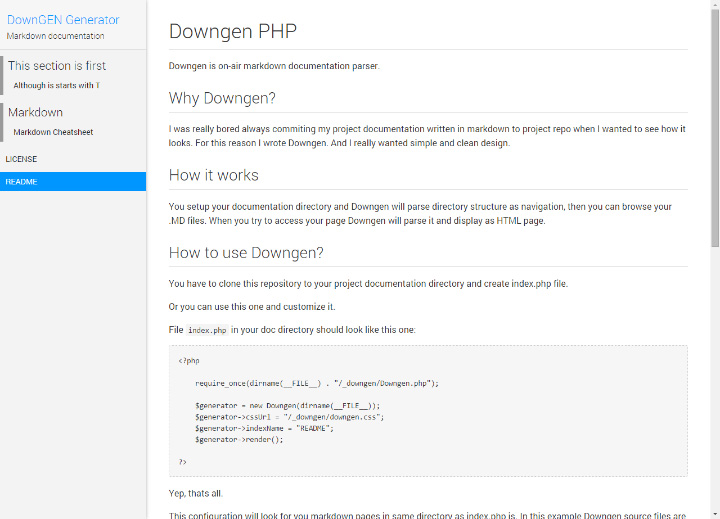

# Downgen PHP

Downgen is on-air markdown documentation parser.

## Why Downgen?
I was really bored always commiting my project documentation written in markdown to project repo when I wanted to see how it looks. For this reason I wrote Downgen. And I really wanted simple and clean design.

## How it works
You setup your documentation directory and Downgen will parse directory structure as navigation, then you can browse your .MD files. When you try to access your page Downgen will parse it and display as HTML page.

## How to use Downgen?
You have to clone this repository to your project documentation directory and create index.php file.

Or you can use this one and customize it.

File `index.php` in your doc directory should look like this one:

```
<?php

	require_once(dirname(__FILE__) . "/_downgen/Downgen.php");

	$generator = new Downgen(dirname(__FILE__));			// Pages directory path is first argument and must be absolute path
	$generator->cssUrl = "_downgen/downgen.css";			// CSS url - should be relative from index to Downgen or custom
	$generator->indexName = "README";						// You can change default page name
	$generator->title = "DownGEN Generator";				// The blue title
	$generator->description = "Markdown documentation";		// Text under The blue title
	$generator->excludePattern = "[_\.]"					// You can modify navigation exclude regexp pattern
	$generator->render();									// Start that little machine

?>
```

Yep, thats all.

This configuration will look for you markdown pages in same directory as index.php is. In this example Downgen source files are located in `_downgen` subdirectory. See [Hidden pages](#hidden-pages) section for explanation why the directory name begins with underscore.

## User interface screenshot
[](screenshot.jpg)

## Navigation page names
Page and directory title is filename without .md extension and underscores with dashed are replaced by spaces.

You can also number your files due to file ordering in following format and numbers will be removed: `01__First page`.

For example:

- `Page.md` = `Page`
- `My_page.md` = `My page`
- `My-page.md` = `My page`
- `01__First-page` = `First page`

<a name="hidden-pages"/>
## Hidden pages and directories
Pages or directories prefixed with `.` or `_`  are hidden from navigation tree.

## Relative links
Links beginning with `./` are rewrited to use Downgen - for example: `./Page.md` is rewrited to `?page=Page`.

## MD2HTML Utility
md2html.php is command-line script which converts all .md files in source directory into stand-alone HTML files with CSS and contents included.

Usage:  
`php md2html.php <src dir> <dst dir> <title> <description> [index name]`

Example of converting all files in same directory as script to _html directory with INDEX.md as homepage:  
`php md2html.php . _html "MyTitle" "MyDoc Description" INDEX`

## Licenses
Downgen is licensed under MIT license - see [LICENSE.md](./LICENSE.md)

### Used libraries
- [Parsedown](https://github.com/erusev/parsedown) and Parsedown Extra by [Emanuil Rusev](https://github.com/erusev) licensed under MIT license
- [Markdown / Github CSS](https://github.com/sindresorhus/github-markdown-css) by [Sindre Sorhus](https://github.com/sindresorhus) licensed under MIT license

## Whats next?
Future development ideas:
- Syntax highlighting
- Page editing